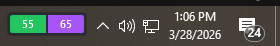

# Claude Usage Monitor for Windows

## What this fork does

**This fork keeps the full upstream behavior** — up to **four system tray icons** with live Claude Code usage % (session, weekly, optional Sonnet-only and overage), OAuth via your existing `~/.claude` login, WSL credential discovery, and the same tray menus — **and adds one new feature:**

| New in this fork | What you get |
|------------------|--------------|
| **HUD overlay** | A tiny **always-on-top** strip (two color blocks: **session %** and **weekly %**) that sits **next to the system tray** like an FPS counter. Toggle from the tray, **drag to move**, **right-click for the same menu as the session icon**, position saved under `%LocalAppData%\ClaudeUsage\hud.json`. |

**Stack:** .NET **9** (`net9.0-windows`), **WPF** for the overlay only; no Electron, no Python, single-folder `ClaudeUsage.exe`.

> [!NOTE]
> **Lineage:** Fork of [sr-kai/claudeusagewin](https://github.com/sr-kai/claudeusagewin). Use GitHub’s **Fork** on that repo if you want the “forked from …” badge on your copy.

Monitor Claude Code usage from the tray **and** optionally from the on-screen HUD.

Lightweight, no installer required. Works with **Claude Code for Windows** or **Claude Code in WSL**.

*Screenshot: tray icons with hover tooltip (session %) and the optional **HUD** strip (session + weekly %) beside the system tray.*



## Features

- **Native & lightweight** — run a single `ClaudeUsage.exe`; no installer required
- **Zero configuration** — uses your existing Claude Code login (OAuth). No API key to paste
- **Up to 4 tray icons** — Session (5h), Weekly (7d), Sonnet Only, and Overage, each with a live percentage and color-coded status
- **Optional HUD overlay** — small borderless window above the taskbar (session + weekly %). Toggle from the tray menu; drag to move; position saved under `%LocalAppData%\ClaudeUsage\hud.json`
- **Color-coded status** — green (under pace), yellow (normal), red (high usage or >95%), gray (error/no data)
- **Smart credential discovery** — finds credentials from Claude Code on Windows or WSL (Debian, Ubuntu, etc.), preferring the most recently used file
- **WSL availability guard** — WSL paths time out if WSL is not running
- **14 languages** — auto-detected with override in the context menu
- **Adaptive polling** — wake intervals adjust for idle, errors, and upcoming quota resets
- **Token auto-refresh** — refreshes OAuth tokens before expiry
- **Launch at Login** — optional startup entry from the tray menu
- **Show Details** — show or hide Sonnet Only and Overage tray icons

## Requirements

- Windows 10 or Windows 11 (64-bit)
- [.NET 9 SDK](https://dotnet.microsoft.com/download/dotnet/9.0) (only if you build from source)
- Claude Code installed and logged in. The app reads `~/.claude/.credentials.json` (Windows or WSL).

## Quick start (download)

1. Open **[Releases](https://github.com/kaydensigh/claudeusagewin/releases)** on this fork (or your own fork’s Releases if you published there).
2. Download **`ClaudeUsage.exe`** from the latest release assets.
3. Put it anywhere you like and double-click to run (Windows may show SmartScreen — “More info” → Run anyway if you trust the build).

No build tools required for end users.

## How to use

| Action | What happens |
|--------|----------------|
| **Hover** a tray icon | Tooltip: usage % and time until reset |
| **Right-click** a tray icon | **Refresh Now**, **Toggle HUD overlay**, **Show Details**, **Launch at Login**, **Language**, **Exit** |

### HUD overlay (optional)

- **Tray → Toggle HUD overlay** — show or hide the small overlay.
- **Left-click** the overlay — toggle visibility (click vs. drag to move).
- **Right-click** the overlay — opens the **same** menu as the session tray icon (Refresh, Toggle HUD, Show Details, Launch at Login, Language, Exit).

#### Disclaimer: HUD overlay quirks (help wanted)

The HUD is a tiny always-on-top WPF window sitting next to the Windows shell (taskbar, Explorer, notification area). Depending on timing and OS version, you may still see any of the following:

- **Brief flicker** when tray settings change or the shell refreshes  
- The overlay **vanishing for a moment** and then coming back  
- The HUD **drawing behind the taskbar** until the next topmost “re-pin”

The app mitigates this with debounced `SetWindowPos` (`HWND_TOPMOST`) and extra reasserts on load, but **this is not fully solved**. If you can improve stability (smooth z-order, zero flash, no transient hide) without breaking tray menus or focus behavior, **pull requests are very welcome**—open an issue or send a PR.

### Tray icon not visible?

1. **Taskbar** → **Taskbar settings**
2. **Other system tray icons** (Windows 11) or **Select which icons appear on the taskbar** (Windows 10)
3. Turn **Claude Usage** / **ClaudeUsage** on.

## How it works

Credentials are resolved in order:

1. `%USERPROFILE%\.claude\.credentials.json` (Windows native)
2. `\\wsl$\{distro}\home\{user}\.claude\.credentials.json` for common distros

If both exist, the newer file wins. The app calls Anthropic’s usage API with your OAuth token.

> **Note:** This relies on usage endpoints that may change without notice.

---

## For developers: clone & build from GitHub

```bash
git clone https://github.com/kaydensigh/claudeusagewin.git
cd claudeusagewin
```

Or use your own fork URL after you fork on GitHub.

To **track the original project** (optional), add it as `upstream` and fetch when you want to merge or compare:

```bash
git remote add upstream https://github.com/sr-kai/claudeusagewin.git   # skip if you already have upstream
git fetch upstream
```

If `upstream` already exists, use `git remote set-url upstream https://github.com/sr-kai/claudeusagewin.git` to point it at the canonical repo.

### Build (CLI)

```bash
cd ClaudeUsage
dotnet build -c Release
```

Output: `ClaudeUsage\bin\Release\net9.0-windows\win-x64\ClaudeUsage.exe` (and dependencies next to it).

### Publish a single folder (for sharing or testing)

```bash
cd ClaudeUsage
dotnet publish -c Release -r win-x64
```

Output: `ClaudeUsage\bin\Release\net9.0-windows\win-x64\publish\` — copy the whole folder or zip it; `ClaudeUsage.exe` is the entry point.

### Visual Studio

1. Open `ClaudeUsage.sln` in the repo root (or `ClaudeUsage/ClaudeUsage.csproj`).
2. Select **Release** and build.

If the app is already running from the same output folder, the project tries to close `ClaudeUsage.exe` before build so the EXE is not locked. You can disable that with `-p:KillRunningClaudeUsageBeforeBuild=false` if needed.

---

## Upload your fork to GitHub

If you started from a local copy and need a remote:

```bash
git remote add origin https://github.com/YOUR_USERNAME/YOUR_REPO.git
git branch -M main
git push -u origin main
```

To publish **releases** for others to download:

1. Push your `main` (or default) branch to GitHub.
2. In the repo: **Actions** → **Release** workflow → **Run workflow** (manual dispatch).  
   This bumps the version in `ClaudeUsage.csproj`, publishes `ClaudeUsage.exe`, and creates a GitHub Release with that binary.

You can also create a release manually: **Releases** → **Draft a new release**, attach `ClaudeUsage.exe` from your `dotnet publish` output.

---

## Tech stack

- **C# / .NET 9** (`net9.0-windows`), **WPF** for the optional HUD window
- **H.NotifyIcon** — tray icons
- **System.Drawing** — tray icon bitmaps
- **System.Text.Json** (source-generated contexts) for API and HUD settings JSON

---

## License

MIT
